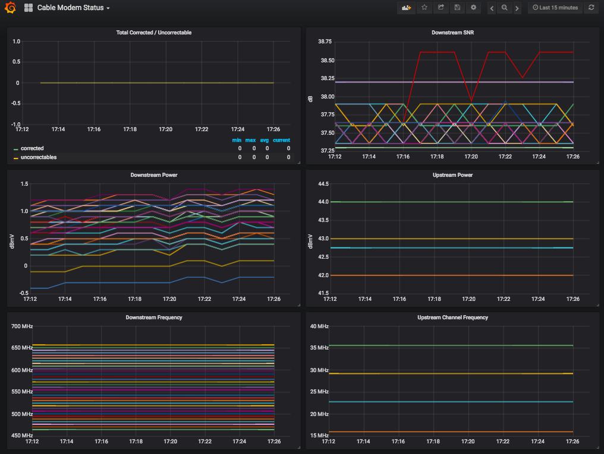

# Arris cable modem plugin for collectd

This plugin scrapes upstream/downstream channel information from an Arris cable modem status page.

All this was developed on a Raspberry Pi 2 running Debian (Raspbian) Jessie.  So it's using dated components like beautifulsoup3 and python2.

## Requirements

- collectd
- python2.7
- python-requests
- python-beautifulsoup

## Install

Install collectd and python modules

    sudo apt-get install collectd python-requests python-beautifulsoup

Copy python script and types.db to /etc/collectd

    cp arris_modem.py /etc/collectd/
    cp arris_modem_types.db /etc/collectd/

## Configure

Add the following lines to your collectd.conf

    TypesDB "/etc/collectd/arris_modem_types.db"

    <LoadPlugin python>
        Globals true
    </LoadPlugin>

    <Plugin python>
        ModulePath "/etc/collectd"
        LogTraces true
        Interactive false
        Import "arris_modem"
        <Module arris_modem>
            Host "mymodem"
            Url "http://192.168.100.1"
        </Module>
    </Plugin>

Then restart collectd

    sudo systemctl restart collectd

## Dashboard

Example Grafana dashboard

